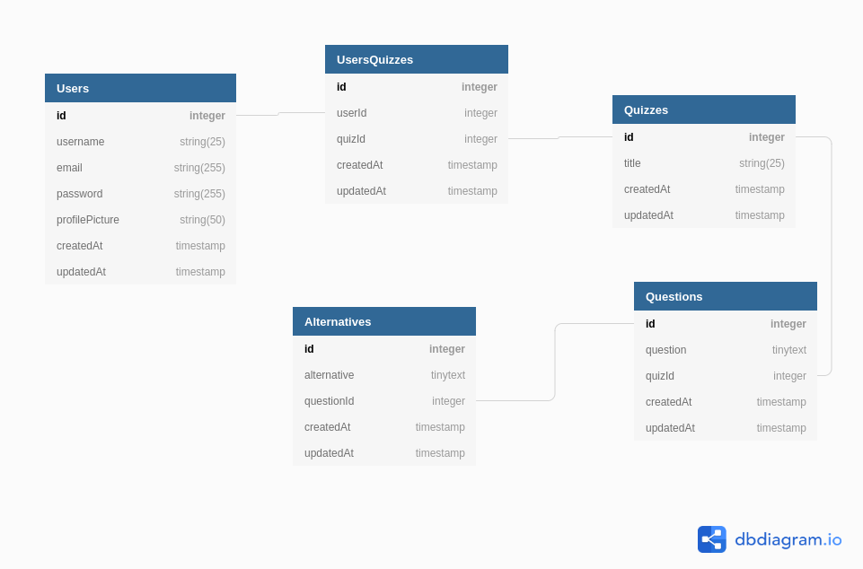

# Quiz API

I have been learning some technologies now, then I decided to began this simple project where I can practice my programming abilities. The endpoint is going to be written using ExpressJS and I am going to be using a relational database, Mysql. The Use Case is follow down.

## Use Case

### Sign-up

__Description:__

All the users have to have an account in order to access the system. 

__Request:__

_Post /auth/signup_

    {
	    username: "name",
        email: "email",
		password: "password",
		profile_picture: "picture"
    }

__Parameters:__

+ username: required, string
+ email: required, email, unique
+ password: required, string
+ profile_picture: url
  
__Responses:__

    201 - Created.
	200 - OK.
	400 - Bad Request.
    500 - Server Error.

### Login

__Description:__

After the users’ account has been set up, they can use their credentials to sign in the system.

__Request:__

_Post /auth/login_

    {
        email: "email",
		password: "password"
    }

__Parameters:__

+ email: required, email
+ password: required, string

__Responses:__
    
    200 - OK.
	401 - Unauthorized.
    500 - Server Error.

If everything goes right the server will return a json:

    { "token": "hash" }

### Fetch the quizzes by the authenticated user

__Description:__

It's going to return all the quizzes which the authenticated user are related with.

__Request:__

_Get /quiz_

__Headers__

+ _x-access_token: Bearer "add the token here"_

__Responses:__
    
    200 - OK.
	401 - Unauthorized.
    500 - Server Error.

## Database

The project is running _mysql_ at the production and development stage and the _sequelize_ are being used as an Object-Relational Mapping. We are not doing automated tests yet, but I want to use _sqlite3_ in memory later on.

### Schema

